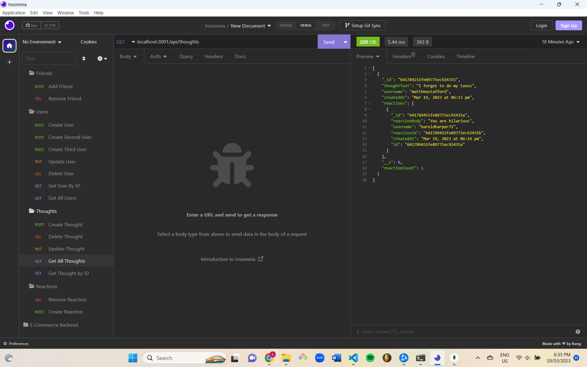

# Social Network API

## Description
This is an API that is created for a social network. It allows users to share their thoughts, add friends, react to others thoughts and update their information. It uses MongoDB to contain the information in the database and express.js for routing, as well as insomnia doing the seeding of the data.

## User Story
```
AS A social media startup
I WANT an API for my social network that uses a NoSQL database
SO THAT my website can handle large amounts of unstructured data
```
## Acceptance Criteria
```
GIVEN a social network API
WHEN I enter the command to invoke the application
THEN my server is started and the Mongoose models are synced to the MongoDB database
WHEN I open API GET routes in Insomnia for users and thoughts
THEN the data for each of these routes is displayed in a formatted JSON
WHEN I test API POST, PUT, and DELETE routes in Insomnia
THEN I am able to successfully create, update, and delete users and thoughts in my database
WHEN I test API POST and DELETE routes in Insomnia
THEN I am able to successfully create and delete reactions to thoughts and add and remove friends to a user’s friend list
```

## Table of Contents
-[Description](description)

-[User Story](#user-story)

-[Acceptance Criteria](#acceptance-criteria)

-[Installation](#installation)

-[Demo](#demo)

-[License](#license)

-[Contributors/Credits](#contributors/credits)

## Installation
Clone the project and run the command:

```
npm install
```

Make sure MongoDB is installed before running the application.


Then run the command:
```
npm run start
```

Open MongoDB and connect to the server.


The data can be seeded and the api routes can then be accessed through insomnia.

## Deployed Link

## Screenshot


## License
MIT License

## Contributors/Credits
This app was created by Aidan Reynolds 
Github: https://github.com/areyno20

References for this project include:

[MongoDB Reference](https://www.mongodb.com/docs/manual/reference/connection-string/)

[Insomnia Documentation](https://docs.insomnia.rest/insomnia/get-started)

UofTSCS Coding Materials
